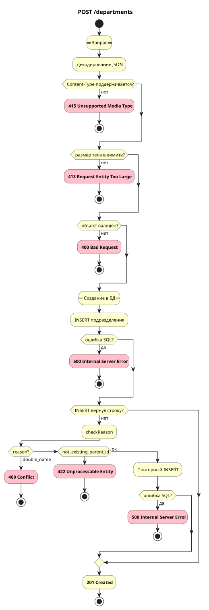

# Создание подразделения

`POST /departments`

## Схема



## Контракт

### Запрос

| Параметр  | Описание                       | Тип     | Обязательность | Ограничения/Формат |
| --------- | ------------------------------ | ------- | -------------- | ------------------ |
| name      | Название подразделения         | string  | Да             | длина `1..200`     |
| parent_id | ID родительского подразделения | integer | Нет            | `1..2147483647`    |

**Пример запроса**

```json
{
  "name": "Backend",
  "parent_id": 1
}
```

### Успешный ответ

Объект `department`: `id`, `name`, `parent_id`, `created_at`.

**Пример ответа**

```json
{
  "id": 32,
  "name": "Backend",
  "parent_id": 1,
  "created_at": "2026-05-28T10:30:29.762878+05:00"
}
```

### Коды ответов

| Код                          | Описание                                                            |
| ---------------------------- | ------------------------------------------------------------------- |
| 201 Created                  | Подразделение создано                                               |
| 400 Bad Request              | Некорректный запрос (ошибки JSON/типы полей/нарушение контракта)    |
| 413 Request Entity Too Large | Тело запроса слишком большое                                        |
| 415 Unsupported Media Type   | Неподдерживаемый Content-Type                                       |
| 422 Unprocessable Entity     | Некорректные данные в запросе (например, parent_id не существует) |
| 409 Conflict                 | Подразделение с таким названием уже существует у того же родителя   |
| 500 Internal Server Error    | Прочие ошибки на сервере                                            |

## Основной сценарий

1. Принять HTTP-запрос `POST /departments`.
2. Разобрать JSON-тело и проверить его по контракту.
3. Вставить подразделение в БД (`INSERT … RETURNING`).
4. Сервис возвращает **201 Created** и объект `department`.

## Альтернативные сценарии

### Альт 1. Шаг 2 - неподдерживаемый Content-Type

1. Заголовок `Content-Type` не поддерживается.
2. Сервис возвращает **415 Unsupported Media Type**.
3. Алгоритм завершается.

### Альт 2. Шаг 2 - слишком большое тело

1. Размер тела превышает лимит.
2. Сервис возвращает **413 Request Entity Too Large**.
3. Алгоритм завершается.

### Альт 3. Шаг 2 - ошибка валидации запроса

1. JSON некорректен или тип поля неверный; `name` отсутствует или `null`; `parent_id` вне диапазона `1..2147483647`; после trim `name` пустой или длиннее 200 символов.
2. Сервис возвращает **400 Bad Request**.
3. Алгоритм завершается.

### Альт 4. Шаг 3 - ошибка SQL при INSERT

1. `INSERT` завершился ошибкой SQL.
2. Сервис возвращает **500 Internal Server Error**.
3. Алгоритм завершается.

### Альт 5. Шаг 3 - дубль имени у родителя

1. `INSERT` не вернул строку; `checkReason` вернул `double_name`.
2. Сервис возвращает **409 Conflict**.
3. Алгоритм завершается.

### Альт 6. Шаг 3 - родитель не существует

1. `INSERT` не вернул строку; `checkReason` вернул `not_existing_parent_id`.
2. Сервис возвращает **422 Unprocessable Entity**.
3. Алгоритм завершается.

### Альт 7. Шаг 3 - повторный INSERT

1. `INSERT` не вернул строку; `checkReason` вернул `ok`.
2. Выполнить повторный `INSERT` (шаг 3 основного сценария).
3. При успехе - шаг 4 основного сценария.

### Альт 8. Шаг 3, после Альт 7 - ошибка SQL при повторном INSERT

1. Повторный `INSERT` завершился ошибкой SQL.
2. Сервис возвращает **500 Internal Server Error**.
3. Алгоритм завершается.

## Производительность

Узкое место было в проверке уникальности названия у родителя. План запроса уходил в `Parallel Seq Scan` и тратил около 150 ms на проверку перед вставкой (без нагрузки).

Запрос приведен к индексному условию через сравнение по `COALESCE(parent_id, 0)`. Это позволило использовать индекс для пары родитель + название и убрать полный проход по таблице из критического пути создания подразделения.

**До оптимизации**
- Цель: 315 RPS
- Факт: 313 RPS
- Задержки: P95 837 ms, P99 нет данных, Max 6721 ms

**После оптимизации**
- Цель: 5000 RPS
- Факт: 4859 RPS
- Задержки: P95 38 ms, P99 130 ms, Max 992 ms
