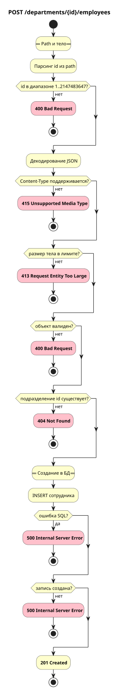

# Создание сотрудника

`POST /departments/{id}/employees`

## Схема



## Контракт

### Запрос

Path-параметры:

| Параметр | Описание         | Тип     | Обязательность | Ограничения/Формат |
| -------- | ---------------- | ------- | -------------- | ------------------ |
| id       | ID подразделения | integer | Да             | `1..2147483647`    |

Тело:

| Параметр  | Описание       | Тип    | Обязательность | Ограничения/Формат |
| --------- | -------------- | ------ | -------------- | ------------------ |
| full_name | ФИО сотрудника | string | Да             | длина `1..200`     |
| position  | Должность      | string | Да             | длина `1..200`     |
| hired_at  | Дата найма     | string | Нет            | `date`             |

**Пример запроса**

```json
{
  "full_name": "Иван Иванов",
  "position": "Backend Developer",
  "hired_at": "2024-03-15"
}
```

### Успешный ответ

Объект `employee`: `id`, `department_id`, `full_name`, `position`, `hired_at`, `created_at`.

**Пример ответа**

```json
{
  "id": 10,
  "department_id": 1,
  "full_name": "Иван Иванов",
  "position": "Backend Developer",
  "hired_at": "2024-03-15",
  "created_at": "2026-05-28T10:30:29.762878+05:00"
}
```

### Коды ответов

| Код                          | Описание                                                                      |
| ---------------------------- | ----------------------------------------------------------------------------- |
| 201 Created                  | Сотрудник создан                                                              |
| 400 Bad Request              | Некорректный запрос (невалидный `id`, ошибки JSON/типы полей/невалидная дата) |
| 413 Request Entity Too Large | Тело запроса слишком большое                                                  |
| 415 Unsupported Media Type   | Неподдерживаемый Content-Type                                                 |
| 404 Not Found                | Подразделение не найдено                                                      |
| 500 Internal Server Error    | Прочие ошибки на сервере                                                      |

## Основной сценарий

1. Принять HTTP-запрос с `id` подразделения в path.
2. Разобрать JSON-тело и проверить его по контракту.
3. Убедиться, что подразделение существует.
4. Вставить сотрудника в БД (`INSERT … RETURNING`).
5. Сервис возвращает **201 Created** и объект `employee`.

## Альтернативные сценарии

### Альт 1. Шаг 1 - невалидный id в path

1. `id` не число, меньше 1 или больше 2147483647.
2. Сервис возвращает **400 Bad Request**.
3. Алгоритм завершается.

### Альт 2. Шаг 2 - неподдерживаемый Content-Type

1. Заголовок `Content-Type` не поддерживается.
2. Сервис возвращает **415 Unsupported Media Type**.
3. Алгоритм завершается.

### Альт 3. Шаг 2 - слишком большое тело

1. Размер тела превышает лимит.
2. Сервис возвращает **413 Request Entity Too Large**.
3. Алгоритм завершается.

### Альт 4. Шаг 2 - ошибка валидации тела

1. JSON некорректен или тип поля неверный; `full_name`/`position` отсутствует или `null`; `hired_at` не в формате `YYYY-MM-DD`; после trim строки пустые или длиннее 200 символов.
2. Сервис возвращает **400 Bad Request**.
3. Алгоритм завершается.

### Альт 5. Шаг 3 - подразделение не найдено

1. Подразделение с `id` не существует.
2. Сервис возвращает **404 Not Found**.
3. Алгоритм завершается.

### Альт 6. Шаг 4 - подразделение исчезло до INSERT

1. FK `23503` при `INSERT`: подразделение удалено после проверки.
2. Сервис возвращает **404 Not Found**.
3. Алгоритм завершается.

### Альт 7. Шаг 4 - INSERT не создал запись

1. `INSERT` не вернул id созданной записи.
2. Сервис возвращает **500 Internal Server Error**.
3. Алгоритм завершается.

### Альт 8. Шаг 4 - ошибка SQL

1. Прочая ошибка SQL при `INSERT`.
2. Сервис возвращает **500 Internal Server Error**.
3. Алгоритм завершается.

## Производительность

Создание сотрудника проверено как отдельный сценарий записи. Перед вставкой сервис проверяет существование подразделения, а уровень репозитория сохраняет защиту от гонки через обработку FK-ошибки, если подразделение удалили между проверкой и записью.

- Цель: 5000 RPS
- Факт: 4570 RPS
- Задержки: P95 8 ms, P99 38 ms, Max 507 ms
