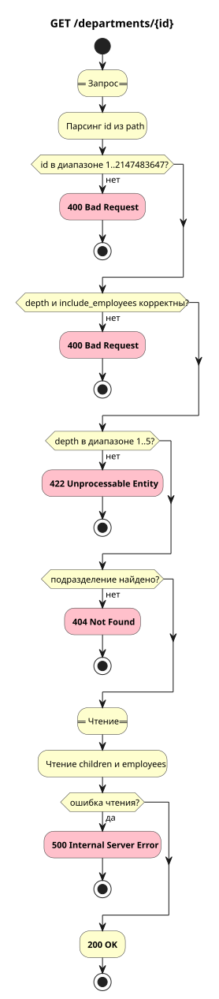

# Получение подразделения

`GET /departments/{id}`

## Схема



## Контракт

### Запрос

Path-параметры:

| Параметр | Описание         | Тип     | Обязательность | Ограничения/Формат |
| -------- | ---------------- | ------- | -------------- | ------------------ |
| id       | ID подразделения | integer | Да             | `1..2147483647`    |

Query-параметры:

| Параметр          | Описание                                                   | Тип  | Обязательность | Ограничения/Формат |
| ----------------- | ---------------------------------------------------------- | ---- | -------------- | ------------------ |
| depth             | Сколько дочерних уровней вернуть. По умолчанию `1`          | int  | Нет            | `1..5`             |
| include_employees | При `false` ключ `employees` в JSON отсутствует. По умолчанию `true` | bool | Нет            | `true` / `false`   |

### Успешный ответ

| Параметр   | Описание                                               | Тип                   | Обязательность |
| ---------- | ------------------------------------------------------ | --------------------- | -------------- |
| department | Запрашиваемое подразделение                            | object (`department`) | Да             |
| children   | Дочерние подразделения по `depth`                      | array (`department`)  | Нет            |
| employees  | Сотрудники подразделения                               | array (`employee`)    | Нет            |

Ключи `children` и `employees` могут отсутствовать в JSON при пустом результате (omitempty).

**Пример ответа**

```json
{
  "department": {
    "id": 1,
    "name": "Engineering",
    "parent_id": null,
    "created_at": "2026-01-01T12:00:00+05:00"
  },
  "children": [
    {
      "id": 2,
      "name": "Backend",
      "parent_id": 1,
      "created_at": "2026-01-02T12:00:00+05:00"
    }
  ],
  "employees": [
    {
      "id": 10,
      "department_id": 1,
      "full_name": "Иван Иванов",
      "position": "Developer",
      "created_at": "2026-02-01T12:00:00+05:00"
    }
  ]
}
```

### Коды ответов

| Код                       | Описание                                                                                         |
| ------------------------- | ------------------------------------------------------------------------------------------------ |
| 200 OK                    | Успешный ответ                                                                                   |
| 400 Bad Request           | Некорректный запрос: невалидный `id`; `depth` не число; `include_employees` не `true`/`false` |
| 422 Unprocessable Entity  | `depth` вне диапазона `1..5`                                                                   |
| 404 Not Found             | Подразделение не найдено                                                                         |
| 500 Internal Server Error | Ошибка чтения children или employees                                                             |

## Основной сценарий

1. Принять HTTP-запрос с `id` в path, `depth` и `include_employees` в query.
2. Найти подразделение и прочитать `children` (recursive CTE по `depth`) и `employees`.
3. Собрать ответ: `department`, `children`, `employees`.
4. Сервис возвращает **200 OK**.

## Альтернативные сценарии

### Альт 1. Шаг 1 - невалидный id

1. `id` не число, меньше 1 или больше 2147483647.
2. Сервис возвращает **400 Bad Request**.
3. Алгоритм завершается.

### Альт 2. Шаг 1 - depth не число

1. `depth` передан, но не является числом.
2. Сервис возвращает **400 Bad Request**.
3. Алгоритм завершается.

### Альт 3. Шаг 1 - include_employees не bool

1. `include_employees` передан, но не разбирается как boolean.
2. Сервис возвращает **400 Bad Request**.
3. Алгоритм завершается.

### Альт 4. Шаг 1 - depth вне диапазона

1. `depth` не в диапазоне `1..5`.
2. Сервис возвращает **422 Unprocessable Entity**.
3. Алгоритм завершается.

### Альт 5. Шаг 2 - подразделение не найдено

1. Подразделение с `id` не существует.
2. Сервис возвращает **404 Not Found**.
3. Алгоритм завершается.

### Альт 6. Шаг 2 - ошибка чтения данных

1. Ошибка при чтении `children` или `employees`.
2. Сервис возвращает **500 Internal Server Error**.
3. Алгоритм завершается.

### Альт 7. Шаг 2 - без сотрудников в ответе

1. `include_employees=false`.
2. `employees` не читаются и отсутствуют в JSON.
3. Продолжение основного сценария (шаги 3-4).

## Производительность

Основная нагрузка метода - чтение дерева подразделений и сотрудников. До оптимизации рекурсивный CTE искал дочерние подразделения через `Parallel Seq Scan`, это было узким местом.

Для чтения дерева добавлен индекс по `parent_id, id`, для сотрудников - индекс по `department_id`. После проверки существования подразделения независимые чтения дочерних подразделений и сотрудников выполняются параллельно через `errgroup`.

**До оптимизации**
- Цель: 50 RPS
- Факт: 46 RPS
- Задержки: P95 281 ms, P99 454 ms, Max 794 ms

**После оптимизации**
- Цель: 5500 RPS
- Факт: 4970 RPS
- Задержки: P95 63 ms, P99 128 ms, Max 782 ms
