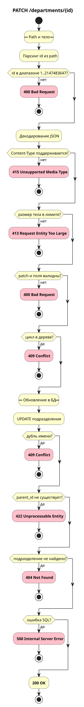

# Обновление подразделения

`PATCH /departments/{id}`

## Схема



## Контракт

### Запрос

Path-параметры:

| Параметр | Описание         | Тип     | Обязательность | Ограничения/Формат |
| -------- | ---------------- | ------- | -------------- | ------------------ |
| id       | ID подразделения | integer | Да             | `1..2147483647`    |

Тело для частичного обновления:

| Параметр  | Описание                          | Тип            | Обязательность | Ограничения/Формат            |
| --------- | --------------------------------- | -------------- | -------------- | ----------------------------- |
| name      | Новое название подразделения                             | string         | Нет            | длина `1..200`, `null` не допускается |
| parent_id | Новый ID родителя / `null` для сброса                    | integer / null | Нет            | `1..2147483647` или `null`            |

Семантика частичного обновления: поле отсутствует - не менять; `parent_id=null` - сброс родителя; `name=null` - ошибка.

**Пример запроса**

```json
{
  "name": "Platform",
  "parent_id": 2
}
```

### Успешный ответ

Объект `department`.

**Пример ответа**

```json
{
  "id": 3,
  "name": "Platform",
  "parent_id": 2,
  "created_at": "2026-01-01T12:00:00+05:00"
}
```

### Коды ответов

| Код                          | Описание                                                                                |
| ---------------------------- | --------------------------------------------------------------------------------------- |
| 200 OK                       | Подразделение обновлено                                                                 |
| 400 Bad Request              | Некорректный запрос (невалидный `id`, ошибки JSON/валидации, `name=null`, пустой patch) |
| 413 Request Entity Too Large | Тело слишком большое                                                                    |
| 415 Unsupported Media Type   | Неподдерживаемый Content-Type                                                           |
| 422 Unprocessable Entity     | parent_id не существует                                                                 |
| 404 Not Found                | Подразделение не найдено                                                                |
| 409 Conflict                 | Конфликт уникальности названия или попытка переместить подразделение в своё поддерево   |
| 500 Internal Server Error    | Прочие ошибки на сервере                                                                |

## Основной сценарий

1. Принять HTTP-запрос с `id` в path и JSON-телом.
2. Разобрать частичное обновление (`name`, `parent_id`) и проверить его по контракту.
3. При смене `parent_id` - проверить отсутствие цикла в дереве.
4. Обновить подразделение в БД (`UPDATE … RETURNING`).
5. Сервис возвращает **200 OK** и объект `department`.

## Альтернативные сценарии

### Альт 1. Шаг 1 - невалидный id

1. `id` не число или вне диапазона `1..2147483647`.
2. Сервис возвращает **400 Bad Request**.
3. Алгоритм завершается.

### Альт 2. Шаг 2 - Content-Type или размер тела

1. `Content-Type` не поддержан - **415 Unsupported Media Type**; тело слишком большое - **413 Request Entity Too Large**.
2. Алгоритм завершается.

### Альт 3. Шаг 2 - ошибка JSON или patch

1. JSON некорректен; неизвестное поле; `name=null`; `name` и `parent_id` оба отсутствуют.
2. Сервис возвращает **400 Bad Request**.
3. Алгоритм завершается.

### Альт 4. Шаг 2 - ошибка валидации name или parent_id

1. `name` после trim пустой или длиннее 200; `parent_id` равен `id`.
2. Сервис возвращает **400 Bad Request**.
3. Алгоритм завершается.

### Альт 5. Шаг 3 - цикл в дереве

1. Новый `parent_id` находится в поддереве обновляемого подразделения.
2. Сервис возвращает **409 Conflict**.
3. Алгоритм завершается.

### Альт 6. Шаг 4 - дубль имени

1. PostgreSQL `23505`: имя уже занято у того же родителя.
2. Сервис возвращает **409 Conflict**.
3. Алгоритм завершается.

### Альт 7. Шаг 4 - родитель не существует

1. PostgreSQL `23503`: `parent_id` не найден.
2. Сервис возвращает **422 Unprocessable Entity**.
3. Алгоритм завершается.

### Альт 8. Шаг 4 - подразделение не найдено

1. `UPDATE` не вернул строку (`id` не существует).
2. Сервис возвращает **404 Not Found**.
3. Алгоритм завершается.

### Альт 9. Шаг 4 - ошибка SQL

1. Прочая ошибка SQL.
2. Сервис возвращает **500 Internal Server Error**.
3. Алгоритм завершается.

## Производительность

Частичное обновление проверено отдельным нагрузочным сценарием.

- Цель: 5000 RPS
- Факт: 4583 RPS
- Задержки: P95 1 ms, P99 3 ms, Max 417 ms
