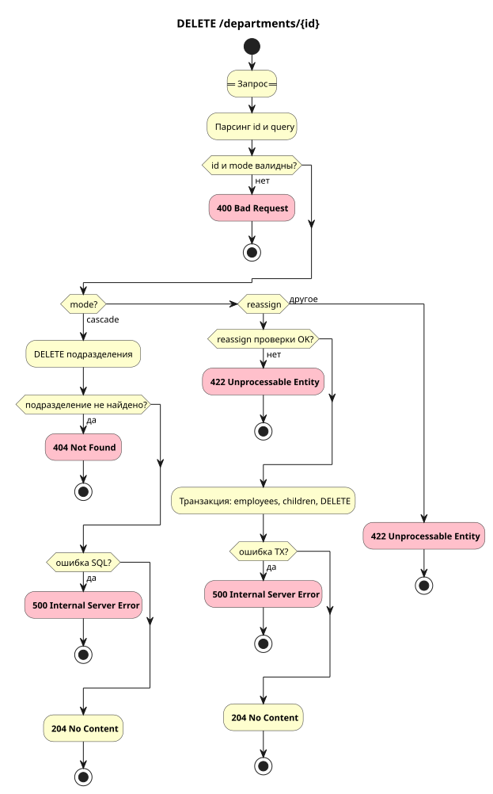

# Удаление подразделения

`DELETE /departments/{id}`

## Схема



## Контракт

### Запрос

Path-параметры:

| Параметр | Описание         | Тип     | Обязательность | Ограничения/Формат |
| -------- | ---------------- | ------- | -------------- | ------------------ |
| id       | ID подразделения | integer | Да             | `1..2147483647`    |

Query-параметры:

| Параметр                  | Описание                               | Тип     | Обязательность         | Ограничения/Формат     |
| ------------------------- | -------------------------------------- | ------- | ---------------------- | ----------------------- |
| mode                      | Режим удаления                         | string  | Да                     | `cascade` или `reassign` |
| reassign_to_department_id | Подразделение для перевода сотрудников | integer | Да при mode=reassign   | `1..2147483647`         |

**Пример запроса**

```
DELETE /departments/5?mode=reassign&reassign_to_department_id=1
```

### Успешный ответ

Тело пустое.

### Коды ответов

| Код                       | Описание                                                                     |
| ------------------------- | ---------------------------------------------------------------------------- |
| 204 No Content            | Подразделение удалено                                                        |
| 400 Bad Request           | Некорректный `id`; не передан `mode`; `reassign_to_department_id` невалидный |
| 404 Not Found             | Подразделение `id` не найдено                                                |
| 422 Unprocessable Entity  | Недопустимый `mode`; ошибки проверок для `mode=reassign` (см. выше)          |
| 500 Internal Server Error | Ошибка SQL / rollback транзакции                                             |

### Поведение mode

- `mode=cascade` - удаляется подразделение `id`; дочерние подразделения и сотрудники удаляются каскадом на уровне БД.
- `mode=reassign` - в одной транзакции:
  1. сотрудники с `department_id = id` переводятся в `reassign_to_department_id`;
  2. у прямых дочерних подразделений (`parent_id = id`) выставляется `parent_id = reassign_to_department_id`;
  3. удаляется подразделение `id`.

При `mode=reassign` дополнительно проверяется:

- `reassign_to_department_id` передан;
- `reassign_to_department_id` не равен `id`;
- подразделение `reassign_to_department_id` существует;
- прямое дочернее подразделение не может быть `reassign_to_department_id`.

## Основной сценарий

1. Принять HTTP-запрос с `id` и `mode` из query.
2. Выполнить удаление в режиме `cascade` или `reassign` (см. ниже).
3. Сервис возвращает **204 No Content**.

### mode=cascade

1. `DELETE` подразделения; потомки и сотрудники удаляются каскадом FK.

### mode=reassign

1. Перевести сотрудников и прямых детей на `reassign_to_department_id`.
2. Удалить подразделение в одной транзакции.

## Альтернативные сценарии

### Альт 1. Шаг 1 - невалидный id

1. `id` не число или вне диапазона `1..2147483647`.
2. Сервис возвращает **400 Bad Request**.
3. Алгоритм завершается.

### Альт 2. Шаг 1 - mode не передан

1. `mode` отсутствует или пустой после trim.
2. Сервис возвращает **400 Bad Request**.
3. Алгоритм завершается.

### Альт 3. Шаг 1 - недопустимый mode

1. `mode` не `cascade` и не `reassign`.
2. Сервис возвращает **422 Unprocessable Entity**.
3. Алгоритм завершается.

### Альт 4. mode=cascade - подразделение не найдено

1. `DELETE` не затронул строку.
2. Сервис возвращает **404 Not Found**.
3. Алгоритм завершается.

### Альт 5. mode=cascade - ошибка SQL

1. Ошибка SQL при `DELETE`.
2. Сервис возвращает **500 Internal Server Error**.
3. Алгоритм завершается.

### Альт 6. mode=reassign - reassign_to не передан

1. `reassign_to_department_id` отсутствует.
2. Сервис возвращает **422 Unprocessable Entity**.
3. Алгоритм завершается.

### Альт 7. mode=reassign - reassign_to невалидный

1. `reassign_to` не число или вне `1..2147483647`.
2. Сервис возвращает **400 Bad Request**.
3. Алгоритм завершается.

### Альт 8. mode=reassign - reassign_to равен id

1. Целевой id совпадает с удаляемым.
2. Сервис возвращает **422 Unprocessable Entity**.
3. Алгоритм завершается.

### Альт 9. mode=reassign - целевое подразделение не существует

1. `reassign_to_department_id` не найден в БД.
2. Сервис возвращает **422 Unprocessable Entity**.
3. Алгоритм завершается.

### Альт 10. mode=reassign - цель - прямой ребёнок

1. `reassign_to_department_id` - прямой дочерний узел удаляемого `id`.
2. Сервис возвращает **422 Unprocessable Entity**.
3. Алгоритм завершается.

### Альт 11. mode=reassign - ошибка транзакции

1. Ошибка SQL или `DELETE` вернул 0 строк - `ROLLBACK`.
2. Сервис возвращает **500 Internal Server Error** или **422 Unprocessable Entity** (0 строк на `DELETE`).
3. Алгоритм завершается.

## Производительность

Каскадное удаление проверено отдельным нагрузочным сценарием.

- Цель: 5000 RPS
- Факт: 4474 RPS
- Задержки: P95 11 ms, P99 59 ms, Max 1183 ms
